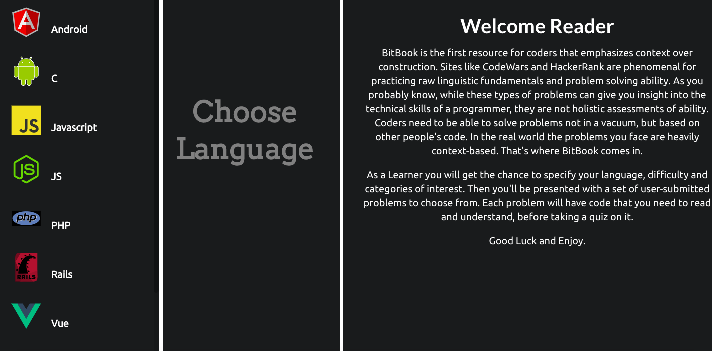

# <h1 align='center'> Bitbook <h1>

The idea of this application is to have a learning platform that allows users to practice reading code and solving problems within a context. This is a beta version. The code samples are arbitrary and quizzes are arbitrary, and the only supported language is Javascript. It is my hope that a platform like this will be developed and that this could at least serve as a template for such a platform.

## Contents

- [Getting Started](#getting_started)
- [Built With](#built_with)
- [Versioning](#versioning)
- [Demo](#demo)
- [Development](#development)

## Getting Started

Fork and clone this repository. `cd` into directory. Run `npm install` to install dependencies. Run `npm start` for development server will be launched.

Ensure to run installation for backend for full application: [Back-End](https://github.com/taylorjayoung/codereader-backend)

## Built With

Built with ReactJS - props, state, keys, events, and fetch api to make calls to the server for frontend. Defined and designed the application's presentation layer using HTML, JSX and custom CSS.

## Versioning

* react version ^16.6.3
* npm version 6.5.0

## Demo

https://www.youtube.com/watch?v=ZdlOitCDaBo&feature=youtu.be

## Deployment

[Live on Heroku](https://thebitbook.herokuapp.com/)
